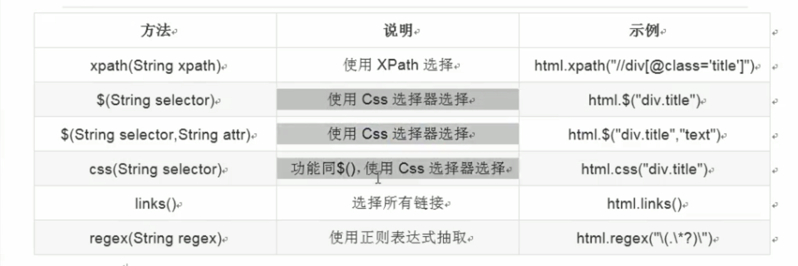
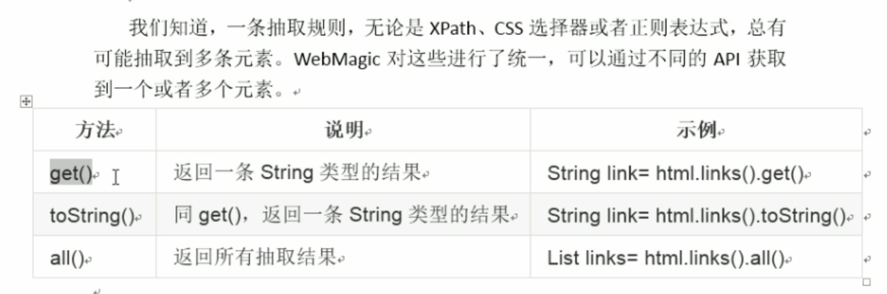
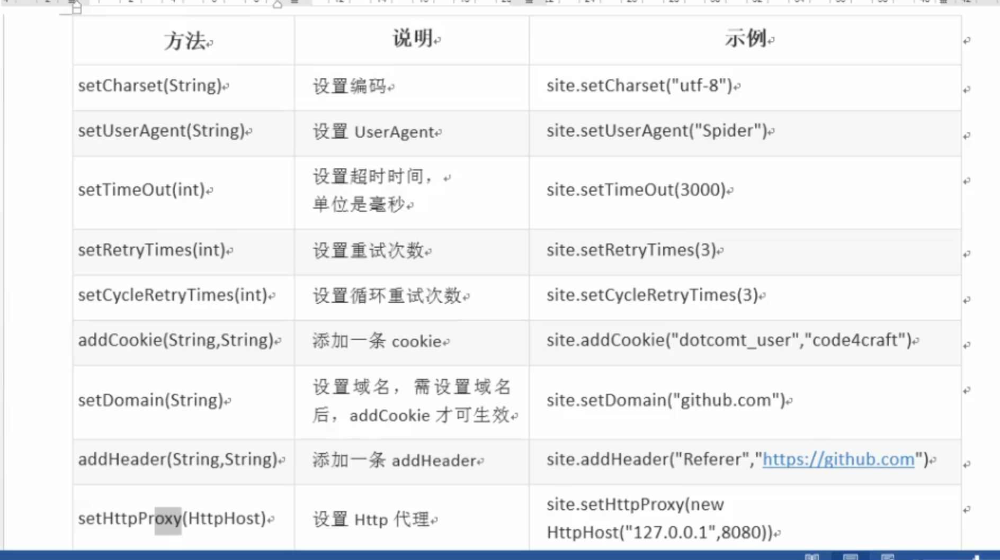
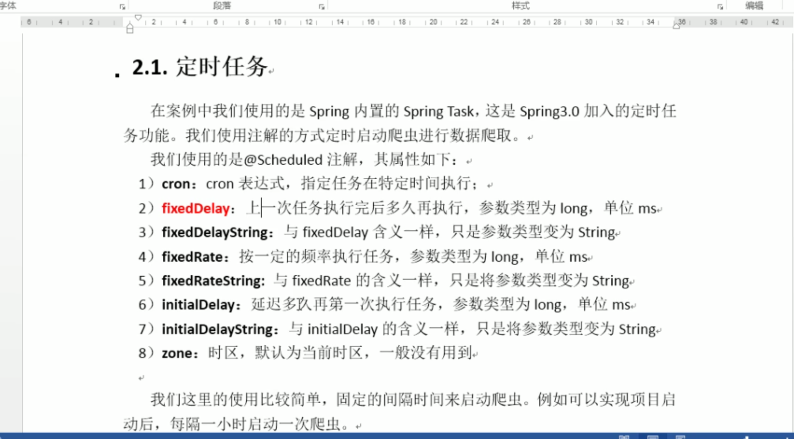
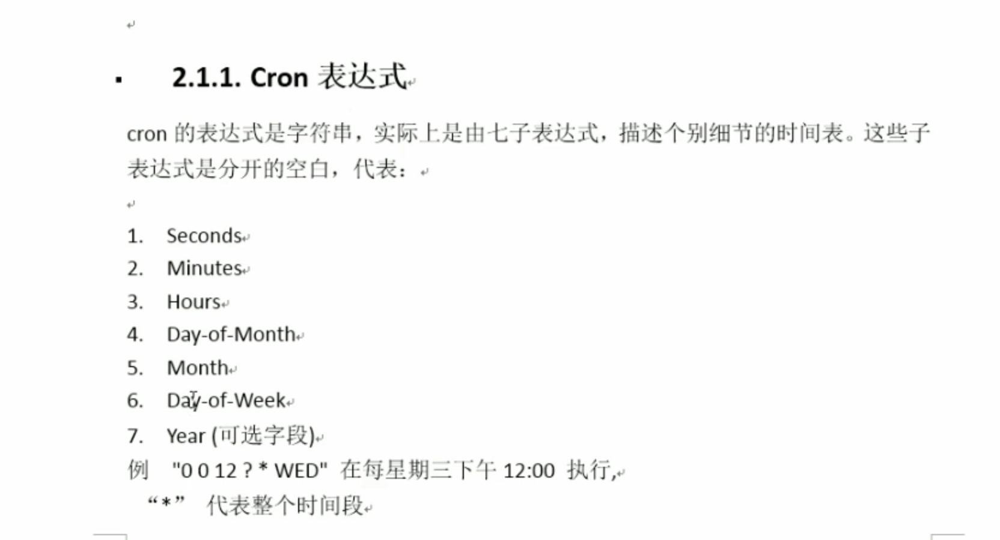

#WebMagic使用




cron表达式生成器


```
CREATE TABLE `job_info`(
	`id` bigint (20) NOT NULL AUTO_INCREMENT COMMENT '主键id',
	`company_name` varchar(100) DEFAULT NULL COMMENT '公司名称',
	`company_addr` varchar(200) DEFAULT NULL COMMENT '公司联系方式',
	`company_info` text COMMENT '公司信息',
	`job_name` varchar(100) DEFAULT NULL COMMENT '职位名称',
	`job_addr` varchar(50) DEFAULT NULL COMMENT '工作地点',
	`job_info` text COMMENT '职位信息',
	`salary_min` int(10) DEFAULT NULL COMMENT '薪资范围，最小',
	`salary_max` int(10) DEFAULT NULL COMMENT '薪资范围，最大',
	`url` varchar(150) DEFAULT NULL COMMENT '招聘信息详情页',
	`time` varchar(150) DEFAULT NULL COMMENT '职位最近发布时间',
	PRIMARY KEY (`id`)
	)
	ENGINE=InnoDB AUTO_increment=1 DEFAULT CHARSET=utf8 COMMENT='招聘信息'; 
```